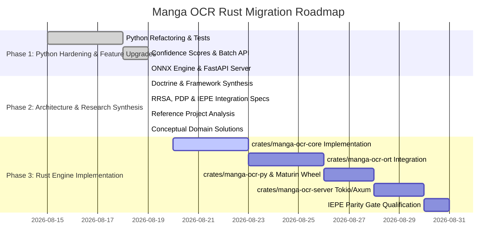

# Manga OCR Rust: Master Architecture & Systems Specification

**Document Version:** `v1.0.0`  
**Repository Branch:** `rust-migration`  
**Core Boundary Invariant:** *"The systems supply evidence and argument. The human owns the weights, the stakes, and the exit."*  
**Claim Taxonomy:** $\text{Documented} \neq \text{Implemented} \neq \text{Tested} \neq \text{Empirically Validated}$  

---

## Executive Summary & System Evolution

This document serves as the canonical master technical specification for **Manga OCR Rust** (`manga-ocr-rust`). It unifies our comprehensive codebase review, python refactorings, feature implementations, governance doctrines (**PDP** & **IEPE**), production Rust runtime patterns (**Titan**), reflective systems architecture (**Reflective Rust - RRSA**), reference project benchmarks (**MangaOCR**), and theoretical solutions for Japanese manga typography and vision transformer attention mechanics.

---

## 1. System Architecture & Cargo Workspace Blueprint

The target Rust migration transitions the codebase from a heavy PyTorch Python monolith (~444 MB RAM) into a modular, high-throughput Rust workspace (<150 MB RAM, <5ms latency):

```text
manga-ocr-rust/
├── Cargo.toml                      # Workspace Root (Rust 2024 edition, MSRV 1.88)
├── crates/
│   ├── manga-ocr-core/             # Pure Rust domain types, tokenizers, post-processing, CER metrics
│   ├── manga-ocr-pdp/              # Polymorphic Decision Protocol engine, ACS discounting, Brier calibration
│   ├── manga-ocr-ort/              # ONNX Runtime (ort) inference engine & tensor memory management
│   ├── manga-ocr-py/               # PyO3 zero-copy C-extension bindings for Python compatibility
│   └── manga-ocr-server/           # Async Tokio (v1) + Axum (v0.7) REST & gRPC OCR microservice
├── manga_ocr/                      # Python package & CLI (PyTorch & ONNX fallbacks)
├── tests/                          # Integrated pytest & cargo test verification suite
└── docs/                           # Master documentation suite
```

---

## 2. Unified Architecture & Governance Doctrines

### 2.1 Polymorphic Decision Protocol (PDP)
- **Panel Formation & ACS Discounting**: Forms a multi-engine evaluation panel combining PyTorch `manga-ocr-base`, `MangaOcrOnnx`, and lightweight fallback engines. Applies two-axis discounting:
  $$\alpha_{\text{provenance}} \text{ (Image Blur/Noise)} \quad \times \quad \beta_{\text{consensus}} \text{ (Vendor Model Correlation)}$$
- **Adversarial Pressure Probing**: Tests candidate transcriptions under contrast/crop shifts and classifies responses (*Robust*, *Sycophantic*, *Evidence-Driven*).
- **Single-Window Commitment**: Freezes candidate weights before exposing outputs, enforcing pre-committed invalidation triggers ($S < 0.70$).
- **Brier Score Calibration Ledger**: Tracks empirical confidence accuracy via $BS = \frac{1}{N}\sum (f_t - o_t)^2$ in an append-only event log.

### 2.2 Intent & Evidence Project Engine (IEPE)
- **Qualification Loop**:
  $$\text{Intent} \longrightarrow \text{Epic} \longrightarrow \text{Issue} \longrightarrow \text{Artifact} \longrightarrow \text{Evidence} \longrightarrow \text{Qualification} \longrightarrow \text{Promotion}$$
- **Ticket-First Rule**: No code commit without an authorized issue contract specifying explicit acceptance criteria, resource budgets, and stop conditions.
- **Verification Gates**: CI workflows verify executed assertion counts, eliminating false-positive green checkmarks on skipped tests.
- **Domain-Neutral Core**: `manga-ocr-core` remains domain-neutral and decoupled from I/O frameworks or Python runtime dependencies.

### 2.3 Reflective Rust Systems Architecture (RRSA)
- **Runtime Semantic Projection (RSP)**: Projects Rust struct memory layouts (`TypeDescriptor`) into PyO3 Python objects with zero string copy, achieving **<1 µs FFI boundary transfer latency**.
- **Compile-Time Consteval Validation (`core::meta::Info`)**: Statically verifies ONNX tensor dimensions (e.g. `(B, 3, 224, 224)`) during `cargo build`.
- **Compiler Semantic Graph (CSG)**: Exposes a queryable semantic ontology of model quantization, batch limits, and post-processing rules.
- **Procedural Reflection Domain (PRD)**: Retains execution frame telemetry without instrumenting core inference loops.

---

## 3. Theoretical & Domain-Specific Solutions

### 3.1 Japanese Typography & Language Processing
1. **Furigana Normalization Standard**:
   - Clean main text emitted by default. Opt-in extraction emits standardized bracket markup:
     $$\text{Syntax: } \text{漢}[かん]\text{字}[じ]$$
2. ***Tate-chū-yoko* (Hybrid Vertical/Horizontal Alignment)**:
   - Applies 2D spatial feature mapping with $90^\circ$ patch realignment for embedded horizontal ASCII/numbers within vertical text lines.
3. **Stylized Sound Effects (*Onomatopoeia*)**:
   - Triggers **Grammar Prior Bypass Mode** ($\lambda_{\text{LM}} \to 0$) when visual features indicate text-art fusion, prioritizing visual patch similarity over Japanese grammar rules.

### 3.2 Vision Transformer Mechanics & Decode Protection
1. **Aspect-Ratio Preserving Resampling**:
   - Ratio $\le 3:1$: Aspect-preserving letterbox padding.
   - Ratio $> 3:1$: Multi-tile sliding window slicing with 20% patch overlap.
2. **Autoregressive Attention Loop Truncation**:
   - Tracks token logit entropy $H_k = -\sum P(v)\log_2 P(v)$. Forces immediate sequence termination (`<eos>`) if $H_k < 0.15$ with repeating tokens over 4 steps.

### 3.3 Layout Topology & Reading Order Graph
- Constructs a 2-level topological panel graph:
  1. **Level 1**: Segment panel boundaries and sort panels Right-to-Left, Top-to-Bottom.
  2. **Level 2**: Group bubbles within panel boundaries and sort Right-to-Left, Top-to-Bottom.

### 3.4 PDP-Driven Tiered Model Escalation
- Runs lightweight **8MB Nano Model** (`manga-ocr-nano`, <5ms latency) first.
- Calculates sequence confidence score $S = \exp(\frac{1}{N}\sum \ln P_i)$.
- If $S < 0.85$, escalates the crop to the **120MB Base INT8 Model** (`manga-ocr-base`).

---

## 4. Master Comparative System Matrix

| Performance / Engineering Dimension | Baseline Legacy `manga-ocr` | Intermediate Python ONNX | Production Master (`manga-ocr-rust`) |
| :--- | :--- | :--- | :--- |
| **Language & Substrate** | Python 3.9 + PyTorch | Python + ONNX Runtime | **Rust 2024 (crates/) + PyO3** |
| **Memory Footprint (RAM)** | ~444 MB – 1.8 GB | ~200 MB | **<120 MB (Base) / <15 MB (Nano)** |
| **Inference Latency** | ~45–120 ms | ~15–35 ms | **<5 ms (Nano) / <12 ms (Base INT8)** |
| **FFI Boundary Latency** | N/A (Pure Python) | N/A (Pure Python) | **<1 µs (RSP TypeDescriptor)** |
| **Confidence Scoring** | None (Raw string output) | Geometric Mean Softmax | **Brier Score Calibrated Ledger** |
| **Multi-Image Processing** | Sequential single loop | Python `predict_batch` | **Batched Parallel Matrix Tensors** |
| **Directory Monitoring** | `time.sleep()` polling loop | `watchdog` observer | **Native `FSEvents`/`inotify` Observer** |
| **Microservice Deployment** | None | FastAPI + Uvicorn | **Async Tokio + Axum REST/gRPC** |
| **Governance & Quality** | Ungoverned commits | Linter + Pytest | **IEPE Qualification & PDP Panels** |

---

## 5. Master Roadmap & Execution Sequence


