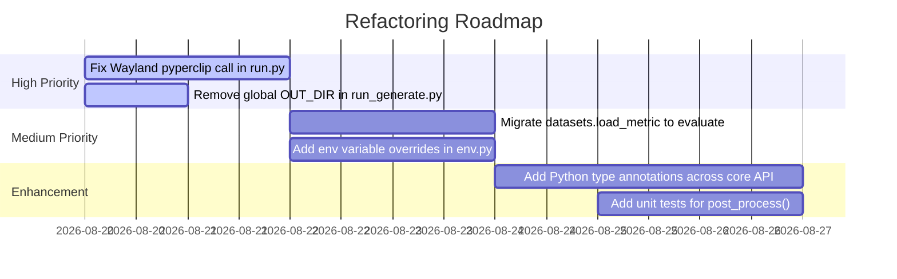

# Comprehensive Code Review & Technical Analysis

This document presents a comprehensive code review of the Manga OCR codebase, assessing architectural design, code quality, technical debt, security/portability concerns, and refactoring recommendations.

---

## Executive Summary

The `manga-ocr` codebase is a well-structured, focused machine learning application. It effectively separates the production inference package ([`manga_ocr/`](file:///Users/zachshallbetter/Projects/manga-ocr-rust/manga_ocr)) from the synthetic data generation and training suite ([`manga_ocr_dev/`](file:///Users/zachshallbetter/Projects/manga-ocr-rust/manga_ocr_dev)). The core technical innovation—using a headless browser engine (`html2image`) for synthetic rendering—delivers high layout quality for complex Japanese typography (vertical text, furigana, tate-chū-yoko) while maintaining a maintainable codebase.

---

## Architectural Strengths

1. **Clear Modular Boundaries**: Production runtime (`manga_ocr`) remains lightweight (~10 dependencies), avoiding dev-only dependencies like `html2image`, `opencv-python`, or `albumentations`.
2. **Device Agnostic Design**: Handles CUDA, Apple Silicon MPS, and CPU fallback gracefully in [`MangaOcr.__init__`](file:///Users/zachshallbetter/Projects/manga-ocr-rust/manga_ocr/ocr.py#L23-L30).
3. **Smart Warmup Cycle**: Performs an initial dummy inference run during constructor initialization ([`manga_ocr/ocr.py:35`](file:///Users/zachshallbetter/Projects/manga-ocr-rust/manga_ocr/ocr.py#L35)) to catch runtime errors early and warm up CUDA/MPS memory before accepting live user requests.
4. **End-to-End Vision-Language Modeling**: Avoids error propagation from separate text line detection + text line recognition stages by recognizing entire speech bubbles in a single forward pass.

---

## Technical Debt & Potential Defects

### 1. Deprecated Metric API (`datasets.load_metric`)
- **Location**: [`manga_ocr_dev/training/metrics.py:7`](file:///Users/zachshallbetter/Projects/manga-ocr-rust/manga_ocr_dev/training/metrics.py#L7)
- **Issue**: `datasets.load_metric("cer")` uses the deprecated Hugging Face `datasets` metrics API, which emits deprecation warnings and may break in future releases.
- **Recommendation**: Upgrade to the official [`evaluate`](https://huggingface.co/docs/evaluate/index) package (`import evaluate; self.cer_metric = evaluate.load("cer")`).

### 2. Invalid Wayland Clipboard Configuration
- **Location**: [`manga_ocr/run.py:76`](file:///Users/zachshallbetter/Projects/manga-ocr-rust/manga_ocr/run.py#L76)
- **Issue**: The line `pyperclip.set_clipboard("wl-clipboard")` attempts to configure `pyperclip` by passing a string. However, `pyperclip.set_clipboard()` is not standard Pyperclip API for backend selection.
- **Risk**: Calling this code path under Wayland Linux sessions may throw an `AttributeError` or `TypeError`.
- **Recommendation**: Verify Pyperclip backend configuration method or invoke `wl-copy` directly via `subprocess` if required.

### 3. Non-Thread-Safe Global Variable in Data Generation
- **Location**: [`manga_ocr_dev/synthetic_data_generator/run_generate.py:53-54`](file:///Users/zachshallbetter/Projects/manga-ocr-rust/manga_ocr_dev/synthetic_data_generator/run_generate.py#L53-L54)
- **Issue**: `run_generate.py` defines `global OUT_DIR` inside `run()` which worker threads access in helper function `f(args)` ([`run_generate.py:21`](file:///Users/zachshallbetter/Projects/manga-ocr-rust/manga_ocr_dev/synthetic_data_generator/run_generate.py#L21)).
- **Risk**: If `run()` is called concurrently across multiple packages in the same Python process, threads will collide on `OUT_DIR`.
- **Recommendation**: Pass `OUT_DIR` explicitly in the argument tuple to `f(args)` instead of relying on module-global state.

### 4. Hardcoded User Home Directory Paths
- **Location**: [`manga_ocr_dev/env.py:5-9`](file:///Users/zachshallbetter/Projects/manga-ocr-rust/manga_ocr_dev/manga_ocr_dev/env.py#L5-L9)
- **Issue**: Directory paths like `Path("~/data/jp_fonts").expanduser()` are hardcoded to fixed home directory paths.
- **Recommendation**: Support override via environment variables (e.g. `os.getenv("FONTS_ROOT", ...)`).

### 5. Double Image Format Conversion
- **Location**: [`manga_ocr/ocr.py:47`](file:///Users/zachshallbetter/Projects/manga-ocr-rust/manga_ocr/ocr.py#L47)
- **Issue**: `img = img.convert("L").convert("RGB")` converts PIL images to 1-channel grayscale and then back to 3-channel RGB before feeding them to the image processor.
- **Recommendation**: Document why 3-channel RGB conversion from grayscale is needed for Hugging Face `ViTImageProcessor` (which expects RGB input channels), or optimize preprocessing if single-channel model variants are introduced.

### 6. Repository Naming Discrepancy
- **Location**: Working directory root folder `manga-ocr-rust`.
- **Issue**: The directory name suggests a Rust implementation, but there are no `.rs` or `Cargo.toml` files present.
- **Impact**: May confuse developers expecting Rust bindings (PyO3 / Maturin).

---

## Code Quality Rating Matrix

| Metric | Rating | Notes |
| :--- | :--- | :--- |
| **Architecture & Modularization** | 9 / 10 | Excellent decoupling of runtime and training dependencies. |
| **Type Annotations & Safety** | 6 / 10 | Limited type hints in function signatures. |
| **Documentation & Examples** | 8 / 10 | Clear root README with CLI examples; now augmented with comprehensive `/docs`. |
| **Test Coverage** | 7 / 10 | Pytest fixture checks end-to-end OCR outputs against expected JSON baselines. Unit tests for post-processing rules could be added. |
| **Portability & Cross-Platform** | 8 / 10 | Solid OS checks for Windows/macOS/Linux; minor Linux Wayland clipboard quirk noted above. |

---

## Prioritized Refactoring Roadmap

