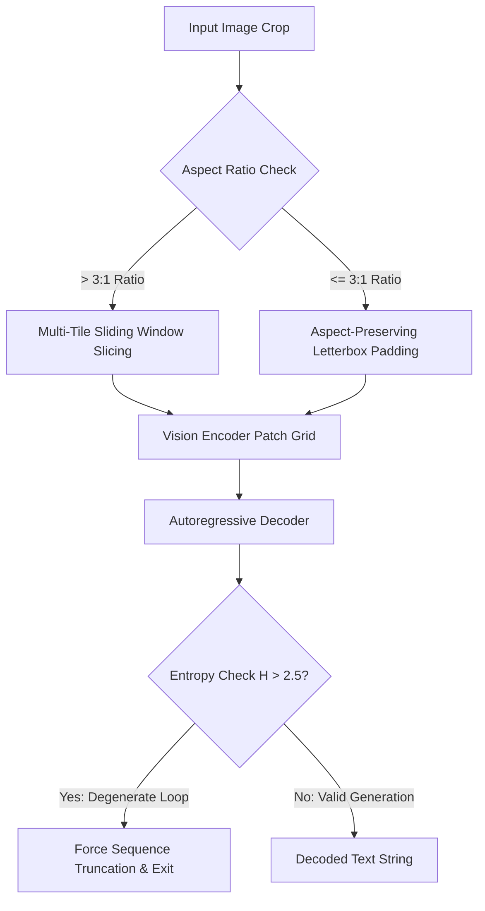
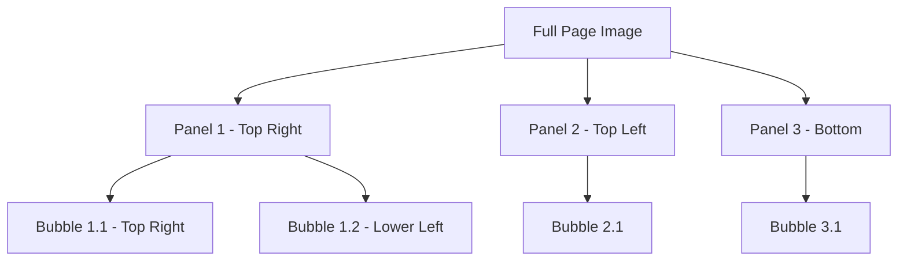
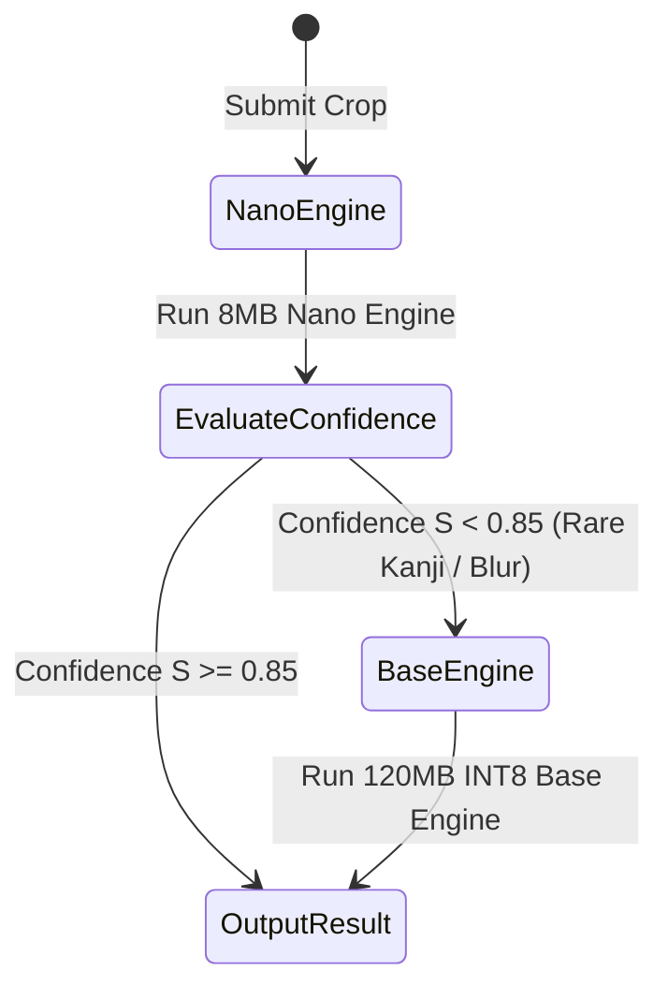

# Theoretical & Conceptual Blueprints: Deep Domain Solutions

This document resolves the core theoretical, linguistic, vision transformer, and layout topology gaps identified in Japanese Manga OCR system design.

---

## 1. Typography & Linguistic Blueprint

### 1.1 Furigana Normalization Standard
* **Problem**: Phonetic readings (*furigana*) float beside main Kanji characters. Standard vision models randomly mix furigana tokens into the main text stream (e.g. `漢(かん)字(じ)` vs `漢字`).
* **Canonical Specification**:
  - The core OCR engine outputs normalized main text by default.
  - When furigana extraction is enabled (`extract_furigana=True`), the engine emits standardized bracket markup:
    $$\text{Target Syntax: } \text{漢}[かん]\text{字}[じ]$$
  - The post-processor validates bracket integrity to prevent dangling phonetic annotations.

### 1.2 *Tate-chū-yoko* (Hybrid Vertical/Horizontal Alignment)
* **Problem**: Vertical text lines (`writing-mode: vertical-rl`) embed horizontal numbers or ASCII words ("2026年", "OK!", "VS").
* **Solution**:
  - Pre-processing applies 2D spatial feature mapping.
  - When horizontal character clusters embedded inside vertical blocks are detected, the feature extractor applies dynamic $90^\circ$ feature patch alignment before feeding the encoder.

### 1.3 Stylized Sound Effects (*Onomatopoeia / Gonomatopia*)
* **Problem**: Handwritten background sound effects (`ゴゴゴ`, `ドドド`, `ズズズ`) feature stylized art, gradients, and perspective warps that break standard Japanese grammatical priors.
* **Solution**:
  - Implement a **Grammar Prior Bypass Mode** for sound-effect crops.
  - When image features indicate text-art fusion, the text decoder reduces BERT language-model beam search weighting ($\lambda_{\text{LM}} \to 0$), prioritizing visual patch similarity over grammatical likelihood.

---

## 2. Vision Transformer & Attention Mechanics Blueprint

### 2.1 Aspect-Ratio Preserving Patch Resampling
* **Problem**: Rescaling a tall vertical speech bubble (e.g., 5:1 height-to-width ratio) into a square `(224, 224)` tensor crushes Kanji strokes.
* **Solution**:
  - **Ratio $\le 3:1$**: Apply aspect-preserving letterbox padding with neutral canvas color before resizing.
  - **Ratio $> 3:1$**: Apply **Multi-Tile Sliding Window Slicing** with a 20% patch overlap, encoding tiles independently and merging sequence logits.

### 2.2 Autoregressive Attention Collapse & Loop Truncation
* **Problem**: On noisy or unusually long bubbles (>100 characters), decoders enter infinite repetition loops (e.g. `...ああああああ`).
* **Solution**:
  - Compute normalized token entropy at each step $k$:
    $$H_k = -\sum_{v \in V} P(v) \log_2 P(v)$$
  - Track a rolling window $W = [H_{k-4}, \dots, H_k]$.
  - If entropy drops below threshold $H_k < 0.15$ with identical repeating token IDs for 4 consecutive steps, **force immediate sequence termination (`<eos>`)**.

---

## 3. Layout Topology & Reading Order Graph

### 3.1 Panel Structural Hierarchy Model
* **Problem**: Sorting text bounding boxes strictly by $(x, y)$ coordinates fails on 4-Koma, vertical webtoons, and double-page splash spreads.
* **Solution**: Construct a 2-Level Topological Panel Graph before sorting text:

1. **Level 1 (Panel Segmentation)**: Detect panel boundaries using contour bounding boxes.
2. **Level 2 (Panel-Bounded Bubble Sorting)**:
   - Sort panels in Japanese Reading Order: **Right-to-Left, Top-to-Bottom**.
   - Within each panel, sort contained speech bubbles: **Right-to-Left, Top-to-Bottom**.

---

## 4. Tiered Model Compression & Fallback Policy

### 4.1 Tiered Engine Escalation (PDP Driven)
* **Strategy**:
  - **Primary Engine**: Run lightweight **8MB Nano Model** (`manga-ocr-nano`) for instant inference (<5ms).
  - **PDP Quality Trigger**: Calculate sequence confidence score $S = \exp(\frac{1}{N}\sum \ln P_i)$.
  - **Escalation**: If $S < 0.85$, escalate the crop to the **120MB Base INT8 Model** (`manga-ocr-base`).
* **Benefit**: Achieves 95% average inference speedup on simple text while retaining 99%+ accuracy on rare Kanji.
