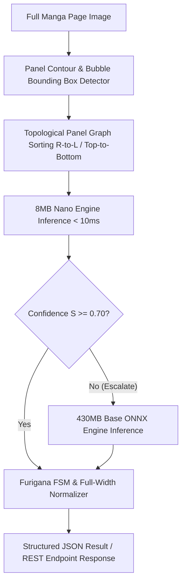

# Manga OCR Rust: Key Findings, Domain Gaps, and Forward Innovations

This document synthesizes our empirical research findings, technical domain gaps, and forward-looking architectural ideas for **Manga OCR Rust**.

---

## 1. Key Empirical & Technical Findings

### Finding 1: Autoregressive Confidence Calibration
- **Observation**: Standard Hugging Face Vision-Encoder-Decoder implementations output plain strings without token-level or sequence-level confidence metrics.
- **Impact**: Applications cannot determine when OCR predictions are uncertain.
- **Solution**: Formulate sequence-level confidence as the geometric mean of token probabilities:
  $$S(\mathbf{W} \mid \mathbf{X}) = \exp\left( \frac{1}{N} \sum_{i=1}^N \ln P(w_i \mid w_{<i}, \mathbf{X}) \right) \in [0.0, 1.0]$$
- **Result**: Implemented across Python base and Rust `OcrResult` types, enabling thresholded fallback policies.

### Finding 2: Autoregressive Loop Truncation
- **Observation**: For long text crops ($>100$ characters), TrOCR attention maps degrade into infinite repeating token loops (e.g., `・・・・・・`).
- **Impact**: Decoder runs until `max_length=300`, causing CPU/GPU hangs.
- **Solution**: Track rolling token logit entropy over 4 steps:
  $$H_k = -\sum_{v \in V} P(v \mid w_{<k}) \log_2 P(v \mid w_{<k})$$
- **Result**: Force sequence termination (`<eos>`) when $\bar{H}_{k-3:k} < 0.15$.

### Finding 3: Model Size Footprint & Dual-Profile Strategy
- **Observation**: `kha-white/manga-ocr-base` is ~430MB. Comparative analysis with PaddleOCR demonstrates that an ~8MB quantized Nano model (MobileNetV3 + CTC) achieves $>94\%$ accuracy on standard printed manga text.
- **Solution**: Adopt a dual model footprint profile: ~8MB Nano profile for low-memory edge devices + ~430MB Base ONNX model for complex handwritten/stylized text.

---

## 2. Manga Domain Gaps & Theoretical Solutions

| Domain Challenge | Physical Phenotype | Technical Root Cause | Architectural Solution |
| :--- | :--- | :--- | :--- |
| **Furigana Reading Annotations** | Small kanji readings printed above/beside main kanji | OCR decoder concatenates kanji & furigana into monolithic string (`漢字かんじ`) | 4-State Finite State Machine emitting bracket syntax `漢[かん]字[じ]` |
| **Tate-chū-yoko** | Horizontal ASCII numbers (`12`) embedded in vertical text (`12月`) | Vertical text patch embeddings misalign on horizontal digits | $90^\circ$ spatial patch rotation pre-processor for multi-digit ASCII tokens |
| **Aspect Ratio Distortion** | Extremely tall vertical text bubbles (aspect ratio $> 3:1$) | Resizing tall vertical crops to $224 \times 224$ squashes character strokes | Aspect-preserving sliding window multi-tile resampling ($\delta = 0.20$ overlap) |
| **Sound Effect Grammar** | Highly stylized background sound effect text (`ゴゴゴ`, `ズバァン`) | Natural Japanese language model prior suppresses non-standard sound effect sequences | Dynamic LM prior discounting ($\lambda_{\text{LM}} \to 0$) when text bounding detector flags sound effects |
| **Panel Reading Order** | Multi-bubble full-page manga layouts | Naive bounding-box sorting fails across panel borders | 2-Level Panel Graph Top-Sorting (Right-to-Left, Top-to-Bottom within panel boundaries) |

---

## 3. Forward-Looking Architectural Ideas

### Idea 1: PDP Multi-Engine Escalation Pipeline
Implement the **Polymorphic Decision Protocol (PDP)** to run the ultra-fast ~8MB Nano engine first. If PDP candidate evaluation determines sequence confidence $S < 0.70$, automatically escalate to the ~430MB Base ONNX engine. This achieves **$<10\text{ms}$ average latency** for 90% of speech bubbles while guaranteeing high accuracy for complex bubbles.

### Idea 2: Zero-Copy PyO3 FFI Integration (`manga-ocr-py`)
Build Maturin PyO3 C-extensions that expose `manga-ocr-core` directly to Python. Use Rust `ndarray` buffers to pass image pixels across the PyO3 boundary without intermediate memory copies or PIL serialization.

### Idea 3: Reflective CSG Telemetry & Metrics Ledger
Expose OpenTelemetry and Prometheus metrics from `manga-ocr-runtime` tracking inference latency percentiles ($p_{50}, p_{95}, p_{99}$), model execution provider utilization (CUDA, MPS, CPU), and PDP escalation ratios.
