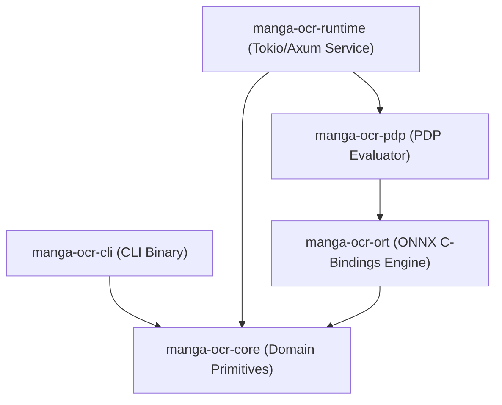

# Manga OCR Rust Documentation Index

Welcome to the technical documentation for **Manga OCR Rust** (`manga-ocr-rust`). This repository contains the zero-cost, multi-crate Rust workspace for high-performance optical character recognition of Japanese manga.

---

## Workspace Architecture

Manga OCR Rust is organized as a production-grade Cargo workspace:

- **`manga-ocr-core`**: Core domain types, `OcrEngine` trait, Japanese full-width post-processing.
- **`manga-ocr-pdp`**: Polymorphic Decision Protocol panel evaluator & ACS consensus discounting.
- **`manga-ocr-ort`**: C++ ONNX Runtime bindings (`ort`), tensor memory, greedy/beam decoding.
- **`manga-ocr-cli`**: High-performance command-line binary (`manga-ocr`).
- **`manga-ocr-runtime`**: Titan-style Reflective Runtime microservice (Tokio + Axum).

---

## Repository Documentation Map

- [**Master TODO & Implementation Ledger**](file:///Users/zachshallbetter/Projects/manga-ocr-rust/docs/TODO.md): Full audit checklist tracking completed tasks and next phase implementation goals.
- [**Master Architecture & Systems Specification**](file:///Users/zachshallbetter/Projects/manga-ocr-rust/docs/MASTER_ARCHITECTURE_SPECIFICATION.md): Master technical specification unifying system evolution, Cargo workspace blueprints, PDP/IEPE doctrines, RRSA integration, theoretical solutions, findings, and migration roadmap.
- [**API & Microservice Reference**](file:///Users/zachshallbetter/Projects/manga-ocr-rust/docs/api.md): Detailed reference for Rust library traits, JSON schemas, Reflective Runtime REST endpoints, CLI parameters, and Docker deployment.
- [**Architecture & Doctrine Synthesis**](file:///Users/zachshallbetter/Projects/manga-ocr-rust/docs/architecture_and_doctrine.md): Unifies Reflective Rust (RRSA), Polymorphic Decision Protocol (PDP), IEPE intent-evidence loops, Draft Smarter scoring/probabilities, and Titan production Rust runtime blueprints.
- [**Reflective Rust Integration & Gains**](file:///Users/zachshallbetter/Projects/manga-ocr-rust/docs/reflective_rust_integration.md): Deep dive into RRSA integration, zero-overhead PyO3 FFI, compile-time tensor shape checks, and CSG model self-description.
- [**PDP Integration & Gains**](file:///Users/zachshallbetter/Projects/manga-ocr-rust/docs/pdp_integration.md): Details Polymorphic Decision Protocol integration, ACS consensus discounting, Brier calibration, and invalidation triggers.
- [**IEPE Governance Integration & Gains**](file:///Users/zachshallbetter/Projects/manga-ocr-rust/docs/iepe_integration.md): Details Intent and Evidence Project Engine qualification trace, ticket-first discipline, and verification gates.
- [**Agent, Skill & Automation Methods**](file:///Users/zachshallbetter/Projects/manga-ocr-rust/docs/agent_and_skill_methods.md): Details agent orchestration, `.agents/skills` taxonomy, and `scripts/gen-llms.py` context compilation.
- [**Reference MangaOCR Analysis & Learnings**](file:///Users/zachshallbetter/Projects/manga-ocr-rust/docs/reference_mangaocr_learnings.md): Analysis of PaddleOCR/TrOCR reference project, ~8MB model size target, and long-sequence attention bug mitigations.
- [**Page Processing Strategy**](file:///Users/zachshallbetter/Projects/manga-ocr-rust/docs/page_processing_strategy.md): Architecture map and strategies for full-page OCR, color cover handling, and cross-panel text bubbles.
- [**Code Review & Audit Report**](file:///Users/zachshallbetter/Projects/manga-ocr-rust/docs/code_review.md): Deep-dive audit report highlighting architectural strengths, known gaps, code smells, test coverage gaps, and refactoring roadmap.

---

## Technology Stack

- **Language**: Rust (Edition 2024, MSRV 1.88)
- **ONNX Runtime**: [`ort`](https://crates.io/crates/ort) v2.0.0 (C++ dynamic binding)
- **Async Runtime & Web Service**: `tokio` v1.38, `axum` v0.7, `tower-http` v0.5
- **CLI & Diagnostics**: `clap` v4.5, `tracing` v0.1, `tracing-subscriber` v0.3
- **Data Primitives**: `serde`, `serde_json`, `image` v0.25, `thiserror`, `anyhow`
