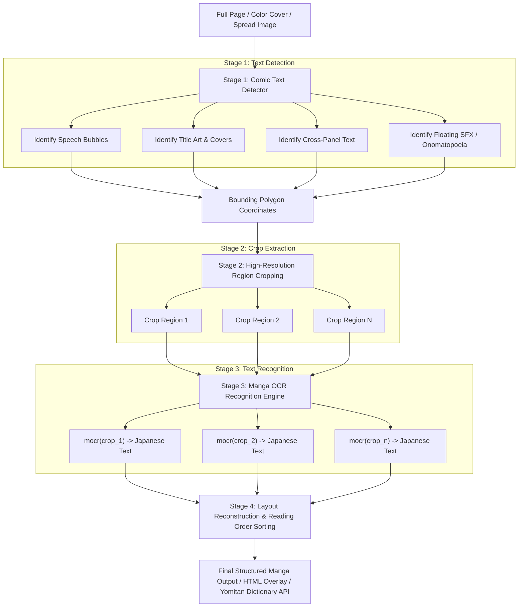
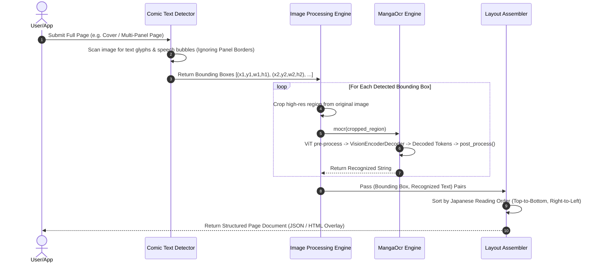

# Page Processing & Layout Strategy

This document defines the architectural strategy for processing complete manga pages, color covers, splash spreads, and text that crosses panel boundaries using Manga OCR.

---

## Problem Statement: Detection vs. Recognition

A complete manga page processing pipeline requires solving two distinct computer vision problems:

1. **Text Detection**: Locating *where* text regions exist on a page and extracting their spatial bounding boxes `(x, y, width, height)`.
2. **Text Recognition**: Transcribing the raw image pixels inside a bounded region into Japanese text character strings.

[`manga-ocr`](manga_ocr/ocr.py#L14-L53) is an end-to-end **Text Recognition Model** based on Hugging Face's [`VisionEncoderDecoderModel`](manga_ocr/ocr.py#L11-L12). When given a single un-cropped page image (e.g. 2000×3000 pixels), the image pre-processor scales the entire image down to a fixed tensor size (e.g. 224×224). At that resolution, individual character details across multiple distant speech bubbles become compressed and blurred, causing recognition errors.

To process full pages, covers, and complex layouts accurately, `manga-ocr` is paired with a **panel-invariant text detector** in a two-stage pipeline.

---

## Architectural Strategy Map



---

## Sequence Execution Map



---

## Edge Case Strategies

### 1. Color Covers & Stylized Title Art
- **Challenge**: Color cover titles (e.g. *"DRAGON QUEST"*, *"エデンの戦士たち"*) feature 3D shadows, gradient fills, stylized Japanese fonts, and complex artwork backgrounds.
- **Strategy**:
  - The text detector isolates the title block as a discrete bounding box.
  - [`manga-ocr`](manga_ocr/ocr.py) decodes stylized fonts accurately because its synthetic training pipeline ([`SyntheticDataGenerator`](manga_ocr_dev/synthetic_data_generator/generator.py#L15)) overlays text on background images with custom CSS font shadows and strokes ([`renderer.py`](manga_ocr_dev/synthetic_data_generator/renderer.py#L323-L334)).

### 2. Text Crossing Panel Borders
- **Challenge**: Speech bubbles or sound effects often overlap black panel border frames.
- **Strategy**:
  - Deep-learning comic text detectors (such as `ComicTextDetector` or DBNet) treat panel border lines as background features.
  - The detector extracts the full speech bubble boundary across the panel division line as a single contiguous polygon.
  - The resulting crop passed to `manga-ocr` contains the complete text block without fragmentation.

### 3. Floating Background Text & Sound Effects (*Onomatopoeia*)
- **Challenge**: Text rendered directly over character artwork or background scenery without speech bubble outlines.
- **Strategy**:
  - The detector identifies text stroke clusters even when no white speech bubble outline exists.
  - `manga-ocr` processes single-channel grayscale conversions ([`img.convert("L").convert("RGB")`](manga_ocr/ocr.py#L52)), ensuring character contrast is preserved against background artwork.

---

## Implementation Blueprint

Below is an example Python integration showing how to pair a text region detector with [`MangaOcr`](manga_ocr/ocr.py#L14-L53) to process full manga pages:

```python
from pathlib import Path
from PIL import Image
from manga_ocr import MangaOcr


def process_full_manga_page(page_path: str, text_detector) -> list[dict]:
    """
    Process a full manga page or color cover.
    
    :param page_path: Path to the full page image.
    :param text_detector: Object detection model returning bounding boxes [(x, y, w, h), ...]
    :return: List of dicts containing bounding box coordinates and recognized text.
    """
    mocr = MangaOcr()
    full_image = Image.open(page_path)
    
    # 1. Detect text regions (ignores panel borders and processes full covers)
    bboxes = text_detector.detect(page_path)
    
    results = []
    for bbox in bboxes:
        x, y, w, h = bbox
        # 2. Crop high-resolution region
        crop = full_image.crop((x, y, x + w, y + h))
        
        # 3. Recognize text with manga-ocr
        text = mocr(crop)
        
        results.append({
            "box": (x, y, w, h),
            "text": text,
        })
        
    # 4. Sort by Japanese reading order (right-to-left, top-to-bottom)
    results.sort(key=lambda item: (-item["box"][0], item["box"][1]))
    return results
```
