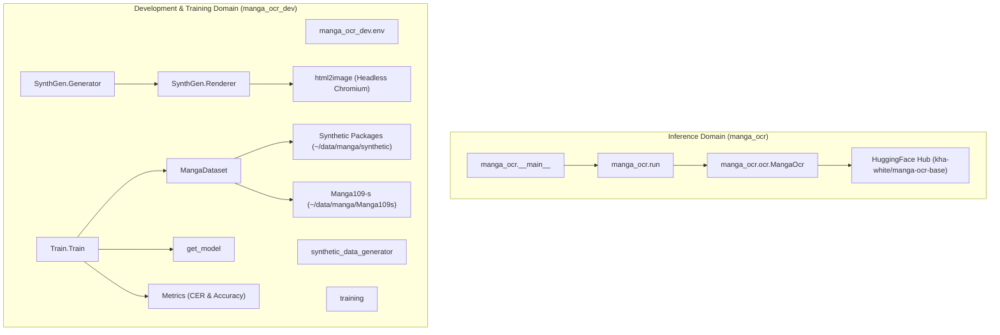

# Manga OCR Repository & Code Structure

This document outlines the directory structure, package organization, and component relationships across the `manga-ocr` codebase.

---

## Directory Taxonomy

```
manga-ocr-rust/
├── assets/                       # Static vocabulary, font metadata, and examples
│   ├── examples/                 # Benchmark/example image samples (00.jpg - 11.jpg, cc-100.jpg, random.jpg)
│   ├── example.jpg               # Warmup image for model initialization
│   ├── fonts.csv                 # Scanned font metadata (path, supported_chars, label)
│   ├── len_to_p.csv              # Manga109-s line length empirical probability distribution
│   ├── lines_example.csv         # Sample text corpus lines for synthetic generator
│   └── vocab.csv                 # Complete character vocabulary supported by tokenizer
│
├── manga_ocr/                    # Production runtime package (Inference & CLI)
│   ├── __init__.py               # Package exports (MangaOcr, __version__)
│   ├── __main__.py               # CLI binary entrypoint (manga_ocr)
│   ├── _version.py               # Version string definition ("0.1.11")
│   ├── ocr.py                    # MangaOcr core model loader & post-processing logic
│   ├── run.py                    # CLI daemon runner (clipboard watcher & folder listener)
│   └── assets/
│       └── example.jpg           # Internal copy of warmup image
│
├── manga_ocr_dev/                # Development, Synthetic Data, & Training Suite
│   ├── README.md                 # Development dataset setup guide
│   ├── __init__.py               # Dev package init
│   ├── env.py                    # Global filesystem path definitions
│   ├── requirements.txt          # Training and rendering dependencies
│   │
│   ├── synthetic_data_generator/ # Synthetic image-text pair rendering pipeline
│   │   ├── README.md             # HTML rendering engine notes
│   │   ├── __init__.py           # Subpackage init
│   │   ├── generator.py          # SyntheticDataGenerator (Budou parsing, furigana, fonts)
│   │   ├── renderer.py           # Renderer (html2image, OpenCV speech bubbles, Albumentations)
│   │   ├── run_generate.py       # Parallel batch dataset generator script
│   │   ├── scan_fonts.py         # TTF/OTF font glyph coverage analyzer
│   │   └── utils.py              # Text character type checkers (Kanji, Hiragana, Katakana, ASCII)
│   │
│   └── training/                 # Model training pipeline
│       ├── __init__.py           # Subpackage init
│       ├── dataset.py            # MangaDataset (synthetic + Manga109-s dataset loader & augmentations)
│       ├── get_model.py          # VisionEncoderDecoderModel & TrOCRProcessor constructor
│       ├── metrics.py            # CER metric computation and exact string accuracy evaluator
│       ├── train.py              # Seq2SeqTrainer execution script with WandB integration
│       └── utils.py              # Model summary helpers & tensor-to-image conversion
│
├── tests/                        # Test suite
│   ├── __init__.py               # Test init
│   ├── generate_expected_results.py # Utility script to generate test expectations
│   ├── test_ocr.py               # Pytest suite against sample image fixtures
│   └── data/
│       ├── expected_results.json # Golden expectations file
│       └── images/               # Sample test image crops
│
├── LICENSE                       # Apache 2.0 / License file
├── README.md                     # Main user documentation
└── pyproject.toml                # Project build metadata & dependencies
```

---

## Package Architecture

The codebase is split into two primary domains:



### 1. Production Package (`manga_ocr`)
- Light footprint intended for end-users.
- Requires only `transformers`, `torch`, `Pillow`, `jaconv`, `fugashi`, `unidic_lite`, `loguru`, `fire`, `pyperclip`, `numpy`.
- Performs inference only, with zero dependency on rendering/training libraries like `html2image` or `albumentations`.

### 2. Development Package (`manga_ocr_dev`)
- Used for reproducing model training or generating synthetic datasets.
- Contains additional heavy dependencies specified in [`manga_ocr_dev/requirements.txt`](manga_ocr_dev/requirements.txt): `html2image`, `albumentations`, `opencv-python`, `datasets`, `wandb`, `budou`, `torchinfo`, `scikit-image`, `fontTools`.

---

## Static Assets Taxonomy ([`assets/`](assets))

- **`vocab.csv`**: Contains all Japanese characters supported by the target tokenizer/model vocabulary.
- **`fonts.csv`**: Index generated by `scan_fonts.py` containing paths to installed TTF/OTF fonts, supported characters per font, and structural font labels (`common`, `regular`, `special`).
- **`len_to_p.csv`**: Empirical probability distribution of text line lengths computed from the Manga109-s corpus, used by `SyntheticDataGenerator` to draw realistic line lengths.
- **`lines_example.csv`**: Sample CSV format (`source`, `id`, `line`) for feeding raw corpus text into the synthetic renderer.
