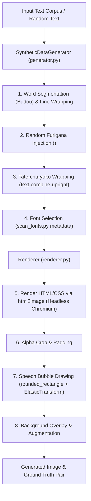

# Synthetic Data Generation Pipeline

This document explains the design, components, and workflow of the synthetic data generator located in [`manga_ocr_dev/synthetic_data_generator/`](manga_ocr_dev/synthetic_data_generator).

---

## Motivation

Training a high-precision manga OCR model requires thousands of annotated text line images. Real manga annotations (like Manga109-s) are limited in size. To achieve high accuracy across diverse Japanese fonts, complex vertical/horizontal text layouts, furigana annotations, and stylized speech bubbles, Manga OCR uses a synthetic generation engine that synthesizes realistic manga text crops.

---

## Architecture & Generation Pipeline

Instead of manually implementing complex Japanese text layout algorithms in Pillow or OpenCV, the engine offloads rendering to **Chromium's headless rendering engine** via [`html2image`](https://github.com/vgalin/html2image).



---

## Component Deep Dive

### 1. `SyntheticDataGenerator` ([`generator.py`](manga_ocr_dev/synthetic_data_generator/generator.py))

- **Word Segmentation**: Uses `budou` (TinySegmenter) to break Japanese text into natural phrase chunks.
- **Line Length Sampling**: Samples line lengths according to empirical manga line length probabilities from [`assets/len_to_p.csv`](assets/len_to_p.csv).
- **Furigana Annotation Injection**: [`add_random_furigana()`](manga_ocr_dev/synthetic_data_generator/generator.py#L121-L167) identifies Kanji character groups using `unicodedata` and randomly injects `<ruby>Kanji<rt>Furigana</rt></ruby>` HTML tags (with 80% Hiragana, 15% Katakana, 5% general vocabulary).
- **Tate-chū-yoko (Horizontal in Vertical)**: Wraps short ASCII character strings (<=3 characters) in `<span style="text-combine-upright: all">` to render horizontal digits/letters inside vertical lines.
- **Font Filtering**: Filters out characters unsupported by the chosen font based on [`font_map`](manga_ocr_dev/synthetic_data_generator/utils.py#L52-L56).

### 2. `Renderer` ([`renderer.py`](manga_ocr_dev/synthetic_data_generator/renderer.py))

- **CSS Generator ([`get_css`](manga_ocr_dev/synthetic_data_generator/renderer.py#L294-L344))**:
  - `writing-mode: vertical-rl;` (70% probability vertical, 30% horizontal).
  - Simulated font stroke using layered CSS `text-shadow`.
  - Custom font loading via `@font-face`.
- **Text Screenshot ([`render_text`](manga_ocr_dev/synthetic_data_generator/renderer.py#L26-L48))**: Uses `html2image` to render transparent PNGs.
- **Speech Bubble Generation ([`render_background`](manga_ocr_dev/synthetic_data_generator/renderer.py#L75-L146))**:
  - Draws rounded rectangles using OpenCV (`cv2.ellipse` and `cv2.line`).
  - Applies `Albumentations.ElasticTransform` to warp rectangular contours into hand-drawn speech bubble shapes.
  - Blends transparent text, speech bubble mask, and manga background art ([`BACKGROUND_DIR`](manga_ocr_dev/env.py#L7)).

### 3. Font Glyph Scanner ([`scan_fonts.py`](manga_ocr_dev/synthetic_data_generator/scan_fonts.py))

- Scans a directory of TrueType/OpenType fonts (`FONTS_ROOT`).
- Tests character rendering using `fontTools.ttLib.TTFont` and Pillow drawing.
- Outputs metadata to [`assets/fonts.csv`](assets/fonts.csv) with character counts and font labels (`common`, `regular`, `special`).

---

## Batch Execution & Package Structure ([`run_generate.py`](manga_ocr_dev/synthetic_data_generator/run_generate.py))

Generated data is partitioned into numeric packages (`0000`, `0001`, ...) to streamline parallel creation and memory allocation:

```
<DATA_SYNTHETIC_ROOT>/
├── img/
│   ├── 0000/               # Generated JPG image files (e.g. random_0000_0.jpg)
│   └── 0001/
├── lines/
│   ├── 0000.csv            # Input corpus text lines
│   └── 0001.csv
└── meta/
    ├── 0000.csv            # Generated metadata (source, id, text, vertical, font_path)
    └── 0001.csv
```

### Running Generation Command

```bash
python -m manga_ocr_dev.synthetic_data_generator.run_generate \
  --package=0 \
  --n_random=1000 \
  --max_workers=16
```
