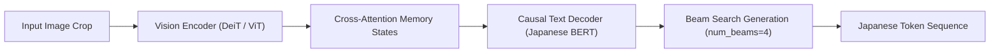

# Manga OCR Training Pipeline

This document describes the model architecture, dataset construction, data augmentation, evaluation metrics, and training procedure in [`manga_ocr_dev/training/`](manga_ocr_dev/training).

---

## Model Architecture

Manga OCR is built using Hugging Face's [`VisionEncoderDecoderModel`](manga_ocr_dev/training/get_model.py#L6) framework, which pairs a Vision Transformer encoder with a Causal Language Model decoder.



### Components ([`get_model.py`](manga_ocr_dev/training/get_model.py))

1. **Vision Encoder**:
   - Default checkpoint: `facebook/deit-tiny-patch16-224` (or ViT base).
   - Configured with `is_decoder=False` and `add_cross_attention=False`.
2. **Text Decoder**:
   - Default checkpoint: `cl-tohoku/bert-base-japanese-char-v2`.
   - Configured with `is_decoder=True` and `add_cross_attention=True`.
   - Supports trimming decoder depth via `num_decoder_layers` (e.g. taking the top 2 layers to reduce model latency).
3. **Custom Processor ([`TrOCRProcessorCustom`](manga_ocr_dev/training/get_model.py#L13-L20))**:
   - Wraps `AutoFeatureExtractor` (vision) and `AutoTokenizer` (text) while bypassing base class type restriction checks.
4. **Generation & Beam Search Config**:
   - `decoder_start_token_id`: `cls_token_id`
   - `pad_token_id`: `pad_token_id`
   - `eos_token_id`: `sep_token_id`
   - `num_beams`: 4
   - `length_penalty`: 2.0
   - `no_repeat_ngram_size`: 3

---

## Dataset & Augmentations ([`dataset.py`](manga_ocr_dev/training/dataset.py))

`MangaDataset` dynamically concatenates synthetic dataset packages with real manga line annotations from the Manga109-s dataset.

### Package Selection Strategy
- **Synthetic Data**: Reads metadata from [`<DATA_SYNTHETIC_ROOT>/meta/*.csv`](manga_ocr_dev/training/dataset.py#L34).
- **Manga109-s Data**: Reads image crop annotations from [`<MANGA109_ROOT>/data.csv`](manga_ocr_dev/training/dataset.py#L48).
- **Package Holdout**: Package `0000` is excluded from training (`skip_packages=[0]`) and reserved exclusively for evaluation/validation.

### Label Masking
Labels are padded to `max_target_length` (default 300). Padding tokens are assigned token ID `-100` so that PyTorch cross-entropy loss functions ignore them during backpropagation.

### Albumentations Pipeline ([`get_transforms`](manga_ocr_dev/training/dataset.py#L118-L161))

Training images are randomly transformed to ensure robustness against scan artifacts, blur, compression, and tilt:

| Augmentation Tier | Probability | Operations |
| :--- | :--- | :--- |
| **None** | 18% | Standard grayscale conversion (`ToGray`). |
| **Medium** | 80% | Slight rotation (5°), perspective distortion, image inversion (5%), downscaling, blur, sharpening, brightness/contrast shift, Gaussian noise, JPEG compression (Q 0-30). |
| **Heavy** | 2% | Stronger rotation (10°), extreme downscaling (0.1x), heavy blur, intense noise, severe JPEG compression (Q 0-10). |

---

## Evaluation Metrics ([`metrics.py`](manga_ocr_dev/training/metrics.py))

During training evaluation, model output token IDs are batch-decoded and evaluated using:
1. **Character Error Rate (CER)**: Computed via the Hugging Face `cer` metric.
2. **Exact Character Accuracy**: `(pred_str == label_str).mean()`.

---

## Training Runner ([`train.py`](manga_ocr_dev/training/train.py))

Training is orchestrated using `transformers.Seq2SeqTrainer` with Weights & Biases (`wandb`) experiment tracking.

```python
python -m manga_ocr_dev.training.train \
  --run_name="manga-ocr-v1" \
  --encoder_name="facebook/deit-tiny-patch16-224" \
  --decoder_name="cl-tohoku/bert-base-japanese-char-v2" \
  --batch_size=64 \
  --num_epochs=8 \
  --fp16=True
```
